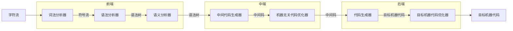

## 编译器是什么

编译器是一个将源代码等价地翻译成另一种语言的程序，它的其中一个重要的工作就是报告它在翻译过程中发现源代码的错误信息

## 概述

编译器的主要步骤，其中包括前端分析，中端转化为中间代码，后端转化为目标机器代码。（其中的前中后端是我自行划分的，可能不正确，龙书将分析部分（将源代码转换为符号表和中间表示形式的部分）成为前端，综合部分（根据中间表示形式和符号表转换为机器原生码的部分）称为后端）

## 词法分析

编译器的第一个步骤是词法分析，传入组成源程序的字符流（也就是源代码），并将它们转换为有意义的词素

> 龙书中指出：词法分析器一般产生下面的词法单元（`token`）作为输出：`<token-name, attribute-value>`
>
> `token-name` 是语法分析步骤使用的抽象符号，而 `<attribute-value>` 指向符号表中关于这个语法单元的条目，符号表条目的信息会被语义分析和代码生成步骤使用

如伪代码 `position = initial + rate * 60` 会转换成 `<id, 1> <=> <id, 2> <+> <id, 3> <*> <number, 4>`，其中的 1、2、3、4 会记录在符号表中。符号表应该存放该标识的名称、类型等元数据信息

## 语法分析

编译器的第二个步骤是语法分析（或叫做解析（parsing）），语法分析器使用词法分析器生成的各个词法单元创建树形的中间表现，该中间表示给出词法单元产生出的词法单元流的语法结构，常见的标识方法是语法树，每个节点代表一个运算，二子节点标识该运算的分量

## 语义分析

编译器的第三个步骤是语义分析，语义分析其使用语法树和符号表中的信息检查源代码是否和语言定义的语义是否一致，同时也会把这些信息存放在语法树或符号表中，以便随后的中间代码生成器的代码生成过程使用。

语义分析的一个重要部分是类型检查，编译器会检查每个运算符是否具有匹配的运算分量（如很多编程语言都会定义数组的校标一定为整数，如果用户使用浮点数作为数组下标，编译器必须报告错误）

有些编程语言可能会允许类型转换（如：一个二元运算符可能会应用于一对整数或一对浮点数，如果这个运算符应用于一个浮点数和一个整数，那么编译器可能会将整数转换（或者说自动类型转换）为一个浮点数）

## 中间代码生成

在语义分析完成之后，很多编译器生成一个明确的低级或类机器语言的中间表示。

中间表示必须具有两个重要的性质：**易于翻译**和**易于生成**

目前有很多主流的 IR 形式：

- 三地址码（如 `id1 = t2 * 30`，右侧只能有一个运算符）

## 代码优化

机器无关的代码优化步骤师傅改进中间代码，以便生成更好的目标机器代码。

使用一个简单的中间代码生成算法，然后在进行代码优化步骤是生成优质的目标语言的一和很合理的方法。

如二元运算时一个浮点数和一个整数相乘，可以直接将那个整数转换为浮点数的形式，就可以消除相应的 `int to float` 运算，因此，优化器可以把原始中间代码转换为更简短更优秀的中间代码

不过这个优化阶段可能会花相当多的实现，有些优化方法可以极大的提高目标程序的运行效率而不会过多的降低编译的速度

## 原生代码生成

代码生成器将源代码的中间表示形式作为输入，然后将其映射到目标语言，如果目标语言是机器代码，那么就应该为程序使用每个变量选择寄存器和内存位置，代码生成的一个关键方面是合理地分配寄存器和存放变量的值

## 符号表管理

编译器的其中一个重要功能就是记录源程序中变量所使用的名字，并收集每个名字的个中枢性有关的信息，可能有储存分配、类型、作用域等信息。

符号表数据结构应该为每一个变量的名字创建一个记录条目，并且应该允许编译器迅速查找到每个名字的记录，而且可以向集合中快速存放和获取记录中的数据。

## 多个步骤结合

编译器可以将多个步骤作为一端（龙书中称为“趟”），如开头我自定义的前中后三端。

我们可以使用不同的前端和目标机器的后端结合起来，为不同的源代码建立该目标机上的编译器，同样我们可以将一个前端和不同的目标机器后端结合起来，建立针对不同目标机器的编译器

## 编译器的构建工具

写编译器的人和任何软件开发者一样，写编译器的人可以充分利用现代的软件开发环境，如 IDE、版本控制软件等工具。人们还创建了一些更加专业的工具来实现编译器的不同阶段，一些常见的编译器构造工具包括：

- 语法分析器的生成器
- 扫描器的生成器
- 语法制导的翻译引擎
- 代码生成器的生成器
- 数据流分析引擎
- 完整的编译器构造工具集

> EOF
